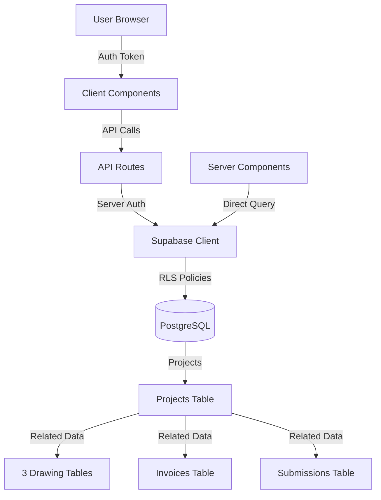

# Supabase Migration Guide

## Overview

This project has been successfully migrated from static data (`public/assets.ts`) to a fully integrated Supabase database. All data is now stored in and fetched from Supabase PostgreSQL database with proper Row Level Security (RLS) policies.

## Database Setup

### 1. Run the Schema Migration

First, create all tables and policies by running the unified schema:

```bash
# Navigate to your Supabase project dashboard
# Go to: SQL Editor > New Query
# Copy and paste the contents of: supabase/migrations/001_unified_schema.sql
# Click "Run" to execute
```

**Or via Supabase CLI:**

```bash
supabase db push supabase/migrations/001_unified_schema.sql
```

### 2. Seed the Database

After the schema is created, populate it with demo data:

```bash
# In Supabase SQL Editor
# Copy and paste the contents of: supabase/migrations/002_seed_data.sql
# Click "Run" to execute
```

**Or via Supabase CLI:**

```bash
supabase db push supabase/migrations/002_seed_data.sql
```

### 3. Verify the Data

Run this verification query in Supabase SQL Editor:

```sql
SELECT 'Projects' as table_name, COUNT(*) as count FROM public.projects
UNION ALL
SELECT 'Drawing Log', COUNT(*) FROM public.drawing_log
UNION ALL
SELECT 'Drawings Yet to Release', COUNT(*) FROM public.drawings_yet_to_release
UNION ALL
SELECT 'Drawings Yet to Return', COUNT(*) FROM public.drawings_yet_to_return
UNION ALL
SELECT 'Invoices', COUNT(*) FROM public.invoices
UNION ALL
SELECT 'Submissions', COUNT(*) FROM public.submissions
UNION ALL
SELECT 'Material Lists', COUNT(*) FROM public.material_lists;
```

**Expected Results:**
- Projects: 3
- Drawing Log: 28
- Drawings Yet to Release: 16
- Drawings Yet to Return: 12
- Invoices: 4
- Submissions: 5
- Material Lists: 2

## Database Schema

### Main Tables

#### 1. **projects**
Master table for all construction projects
- `id` (uuid, primary key)
- `project_number` (text, unique)
- `project_name` (text)
- `client_name`, `contractor_name`, `project_location`
- Tons fields: `estimated_tons`, `detailed_tons_per_approval`, etc.
- Status fields: `detailing_status`, `revision_status`, `release_status`
- Timestamps: `created_at`, `updated_at`

#### 2. **drawing_log**
Complete log of all drawings
- Links to `projects` via `project_id`
- Fields: `dwg`, `status`, `description`, `total_weight`, `pdf_path`
- Release tracking: `release_status`, `latest_submitted_date`

#### 3. **drawings_yet_to_release**
Drawings with FFU status waiting to be released
- Similar structure to `drawing_log`
- Constraint: `status = 'FFU'`

#### 4. **drawings_yet_to_return**
Drawings with APP or R&R status waiting for return
- Similar structure to `drawing_log`
- Constraint: `status IN ('APP', 'R&R')`

#### 5. **invoices**
Project invoices and billing information
- Fields: `invoice_id`, `project_number`, `project_name`
- Billing: `billed_tonnage`, `tons_billed_amount`, `total_amount_billed`
- Change orders: `billed_hours_co`, `co_price`, `co_billed_amount`
- Status: `Paid`, `Pending`, `Overdue`, `Draft`, `Cancelled`

#### 6. **payments**
Payment records linked to invoices via Razorpay
- Links to `invoices` via `invoice_id`
- Razorpay fields: `razorpay_payment_id`, `razorpay_order_id`, `razorpay_signature`
- Status tracking and JSONB response storage

#### 7. **submissions**
Drawing submissions, RFIs, and submittals
- Links to `projects` via `project_id`
- Types: `APP`, `R&R`, `FFU`, `PENDING`, `RFI`, `SUBMITTAL`
- Fields: `work_description`, `drawing_number`, `submission_date`

#### 8. **material_lists** (with related tables)
Material lists with bar items and custom fields
- `material_list_bar_items` - Bar item details
- `material_list_fields` - Custom field key-value pairs

## Application Integration

### File Structure

```
├── lib/
│   ├── database.types.ts           # TypeScript types for all tables
│   └── supabase/
│       ├── client.ts               # Browser client
│       ├── server.ts               # Server client
│       └── queries.ts              # Reusable query functions
├── supabase/
│   └── migrations/
│       ├── 001_unified_schema.sql  # Complete database schema
│       └── 002_seed_data.sql       # Demo data seed script
└── public/
    └── assets.ts                   # [REFERENCE ONLY] Original static data
```

### Updated Files

**API Routes** (all migrated to Supabase):
- `app/api/projects/route.ts` - Projects list
- `app/api/drawings/route.ts` - All drawings (combined from 3 tables)
- `app/api/submissions/route.ts` - Submissions with project joins
- `app/api/billing/invoices/route.ts` - Invoice list
- `app/api/projects/[projectId]/sections/route.ts` - Project sections

**Server Components**:
- `app/projects/page.tsx` - Projects page with Supabase data

### Query Helper Functions

Located in `lib/supabase/queries.ts`:

```typescript
// Projects
getProjects(supabase)
getProjectByNumber(supabase, projectNumber)
getProjectById(supabase, projectId)
createProject(supabase, project)
updateProject(supabase, id, updates)

// Drawings
getDrawingLogByProject(supabase, projectId)
getDrawingsYetToReleaseByProject(supabase, projectId)
getDrawingsYetToReturnByProject(supabase, projectId)
getAllDrawingsByProject(supabase, projectId) // Combined query

// Invoices
getInvoices(supabase)
getInvoicesByProjectNumber(supabase, projectNumber)
updateInvoiceStatus(supabase, id, status, paidDate?)

// Submissions
getSubmissions(supabase)
getSubmissionsByProject(supabase, projectId)
createSubmission(supabase, submission)

// Utilities
calculateWeeksSince(dateString) // Calculate weeks between dates
getProjectMetrics(supabase, projectId) // Dashboard metrics
```

## Environment Variables

Ensure your `.env.local` file contains:

```env
NEXT_PUBLIC_SUPABASE_URL=https://YOUR_PROJECT_REF.supabase.co
NEXT_PUBLIC_SUPABASE_ANON_KEY=YOUR_SUPABASE_ANON_KEY
SUPABASE_SERVICE_ROLE_KEY=YOUR_SERVICE_ROLE_KEY (optional, server-only)
```

## Row Level Security (RLS)

All tables have RLS enabled with policies that:
- **SELECT**: Allow all authenticated users to view data
- **INSERT/UPDATE/DELETE**: Allow all authenticated users to modify data

For production, you may want to restrict policies to specific users or roles.

## Data Flow



## Testing the Migration

1. **Start the development server:**
   ```bash
   npm run dev
   ```

2. **Test these pages:**
   - `/login` - Authentication
   - `/dashboard` - Dashboard with metrics
   - `/projects` - Projects list and details
   - `/billing` - Invoices and payments
   - `/submissions` - Submissions list

3. **Verify data is loading:**
   - Check browser console for any errors
   - Verify Network tab shows Supabase requests
   - Confirm data matches seeded values

## Troubleshooting

### No data showing up?

1. Verify Supabase credentials in `.env.local`
2. Check RLS policies are created
3. Ensure seed script ran successfully
4. Check browser console for errors

### Authentication errors?

1. Ensure user is created in Supabase Auth
2. Verify NEXT_PUBLIC_SUPABASE_ANON_KEY is correct
3. Check browser cookies for auth token

### Query errors?

1. Check Supabase logs in dashboard
2. Verify table and column names match schema
3. Test queries directly in Supabase SQL Editor

## PDF Files

PDF drawings remain in the `public/assets` folder with paths stored in the database:
- Format: `/assets/{PROJECT_NUMBER}/Drawing-Log/{DWG_NO}.pdf`
- Future enhancement: Migrate to Supabase Storage

## Next Steps

1. **Production Setup**: 
   - Create production Supabase project
   - Run migrations
   - Seed with real data

2. **Enhanced RLS**: 
   - Add user-specific policies
   - Implement role-based access control

3. **PDF Migration**: 
   - Move PDFs to Supabase Storage
   - Update paths in database

4. **Real-time Features**: 
   - Add Supabase Realtime subscriptions
   - Live updates for collaborative editing

## Support

For issues or questions:
1. Check Supabase documentation: https://supabase.com/docs
2. Review migration files in `supabase/migrations/`
3. Inspect query functions in `lib/supabase/queries.ts`

